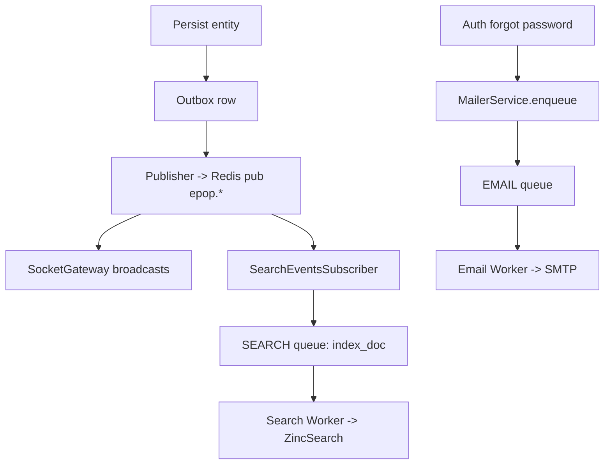

# Job Queue Architecture (BullMQ)

- **Queues (BullMQ)**
  - `email` — password reset, generic notifications
  - `search` — per-entity indexing, backfill
  - `notification` — web push delivery (urgent chat events)
  - `dead` — Dead Letter Queue (DLQ) for failed jobs from workers (email/search/notification)

- **Producers**
  - `backend/src/mailer/mailer.service.ts` — enqueues `password_reset` and `generic` email jobs (attempts/backoff set per job)
  - `backend/src/notifications/notifications.service.ts` — enqueues `push` jobs for urgent chat messages (attempts/backoff)
  - `backend/src/search/search.subscriber.ts` — enqueues `index_doc` on domain events via Redis Pub/Sub
  - `backend/src/search/search.service.ts#enqueueBackfill()` — enqueues `backfill` job (admin-only API)

- **Workers**
  - Module: `backend/src/workers/worker.module.ts`
  - Bootstrap: `backend/src/workers/main.ts`
  - Processors:
    - `backend/src/workers/email.worker.ts` — sends emails via Nodemailer
    - `backend/src/workers/search.worker.ts` — processes `index_doc` and `backfill`
    - `backend/src/workers/notification.worker.ts` — sends Web Push via `web-push`

- **Configuration** (`backend/src/config/env.validation.ts`)
  - `REDIS_URL` — connection for BullMQ
  - `EMAIL_WORKER_CONCURRENCY` (default 5)
  - `SEARCH_WORKER_CONCURRENCY` (default 5)
  - `NOTIFICATION_WORKER_CONCURRENCY` (default 3)
  - SMTP settings used by worker: `SMTP_HOST`, `SMTP_PORT`, `SMTP_USER`, `SMTP_PASS`, `SMTP_SECURE`, `MAIL_FROM`
  - Web Push: `VAPID_PUBLIC_KEY`, `VAPID_PRIVATE_KEY`, `VAPID_SUBJECT`

- **Retries & Priority**
  - Email
    - `password_reset`: priority 1, attempts 5, exponential backoff
    - `generic`: priority 5, attempts 3, exponential backoff
  - Search
    - `index_doc`: attempts 5, exponential backoff
    - `backfill`: attempts 3, fixed backoff
  - Notification
    - `push`: attempts 3, exponential backoff

- **Dead Letter Queue (DLQ)**
  - Queue name: `dead` (provider token `DEAD_QUEUE` in `queues.module.ts`).
  - All workers (`email`, `search`, `notification`) enqueue a `*_failed` job into `dead` on failure with metadata: job id, name, data, attempts made, and reason.
  - Operators can inspect and drain the DLQ to retry or archive.

  - Triage snippet (Node.js):
  ```ts
  import { Queue } from 'bullmq'
  const q = new Queue('dead', { connection: { url: process.env.REDIS_URL || 'redis://localhost:6379' } })
  ;(async () => {
    const jobs = await q.getJobs(['waiting','delayed','failed','completed'], 0, 100)
    console.log('dead jobs:', jobs.length)
    // Example: requeue a failed email job payload back to its original queue
    for (const j of jobs) {
      if (j.name === 'email_failed') {
        const payload = j.data?.data
        const emailQ = new Queue('email', { connection: q.opts.connection })
        await emailQ.add('generic', payload, { attempts: 3, backoff: { type: 'exponential', delay: 5000 } })
        await j.remove()
      }
    }
    process.exit(0)
  })()
  ```

- **Event-Driven Flow**


- **Running locally**
  - API: `npm run start:dev`
  - Worker: `npm run start:worker:dev`

- **API changes**
  - `PUT /search/index/:entity` now enqueues a backfill job and returns `{ enqueued: true }` immediately.

- **Rationale**
  - Offloads heavy tasks from request lifecycle
  - Isolated failure handling with retries/backoff
  - Priority handling (urgent emails over indexing)

- **Files Overview**
  - Producers: `mailer.service.ts`, `notifications.service.ts`, `search.subscriber.ts`, `search.service.ts`
  - Workers: `workers/*.ts`
  - Queues: `queues/queues.module.ts` (global providers `EMAIL_QUEUE`, `SEARCH_QUEUE`, `NOTIFICATION_QUEUE`, `DEAD_QUEUE`)
